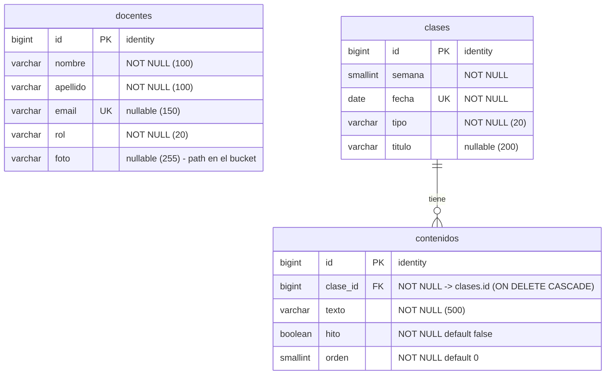

# Esquema de la base de datos

Diagrama entidad-relación de la base (PostgreSQL / Supabase). Fuente de verdad: [`init_db.sql`](init_db.sql).

## Notas

- **`docentes`** es independiente (no tiene relaciones). El listado se ordena Profesor → Ayudante
  → Colaborador. `email` es único (y opcional); `foto` guarda el *path* del archivo en el bucket
  privado de Supabase Storage `docentes-fotos` (la API lo sube/devuelve como base64).
- **`clases` 1—* `contenidos`**: cada clase tiene sus contenidos ordenados por `orden`; borrar una
  clase borra sus contenidos (`ON DELETE CASCADE`). `fecha` es única (un slot lunes/miércoles por
  clase).
- **Campos de valor fijo como `VARCHAR`** (no `ENUM`): la validación vive en Python
  (`constants.py` + validators), para mantener el esquema portable entre motores.
  - `docentes.rol` ∈ `Profesor` | `Ayudante` | `Colaborador`
  - `clases.tipo` ∈ `Presencial` | `Virtual` | `Feriado` | `Sin clases`
- **No hay tabla de usuarios**: el único admin se configura por variables de entorno
  (`ADMIN_USER` / `ADMIN_PASSWORD`).
